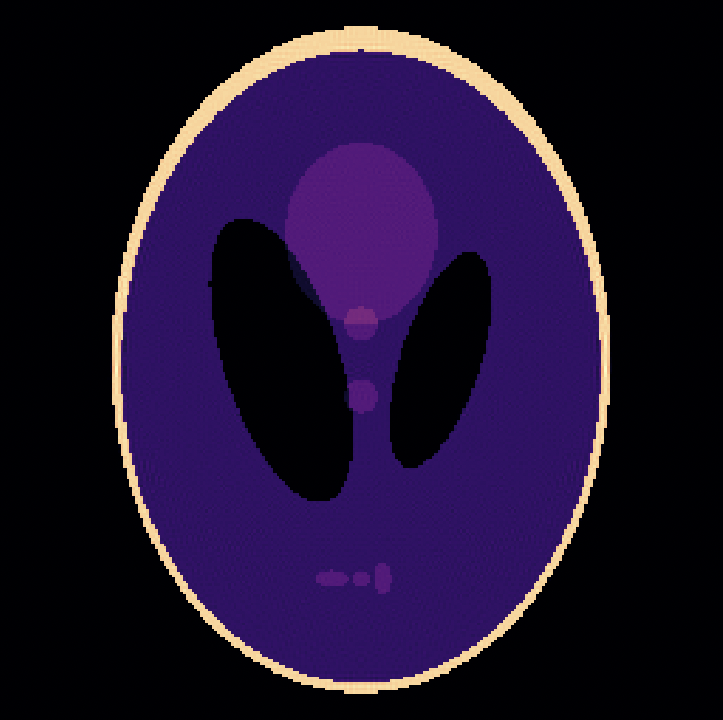
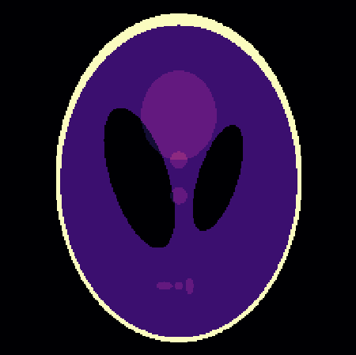
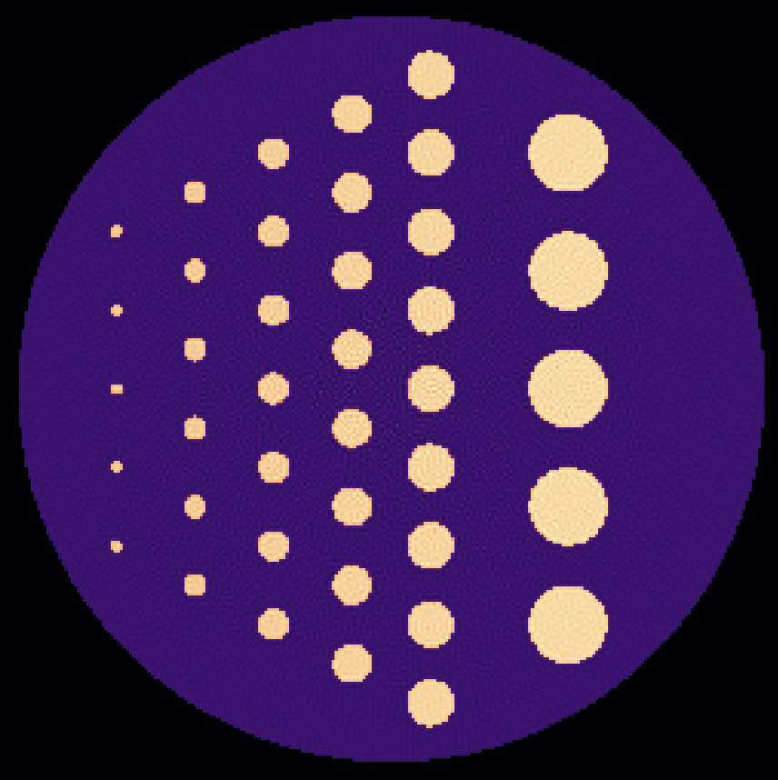
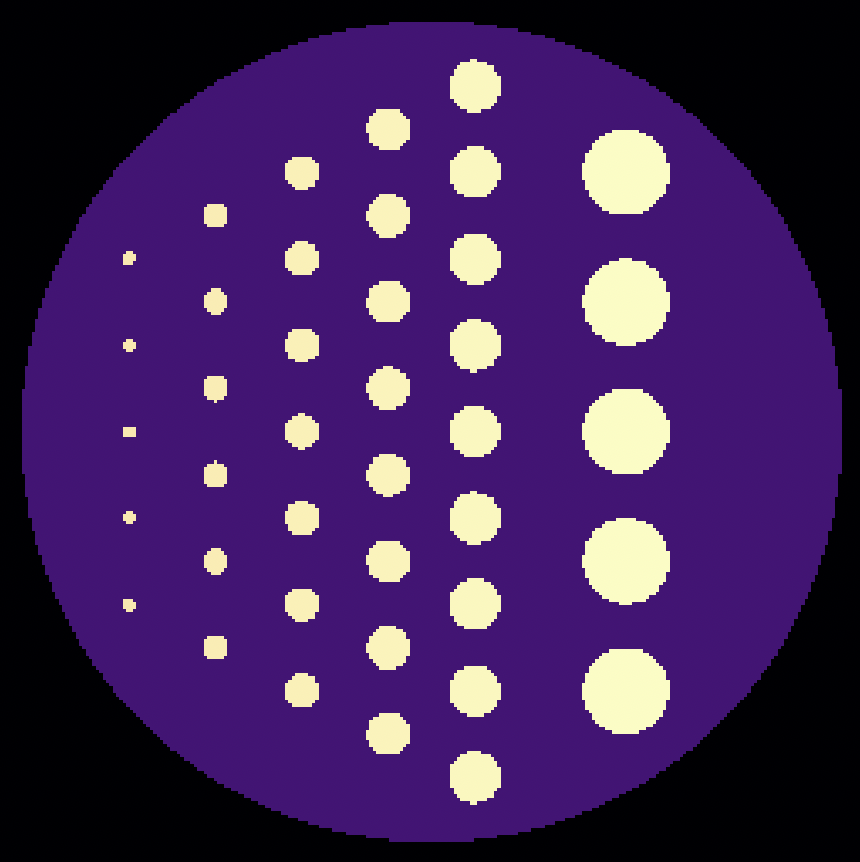
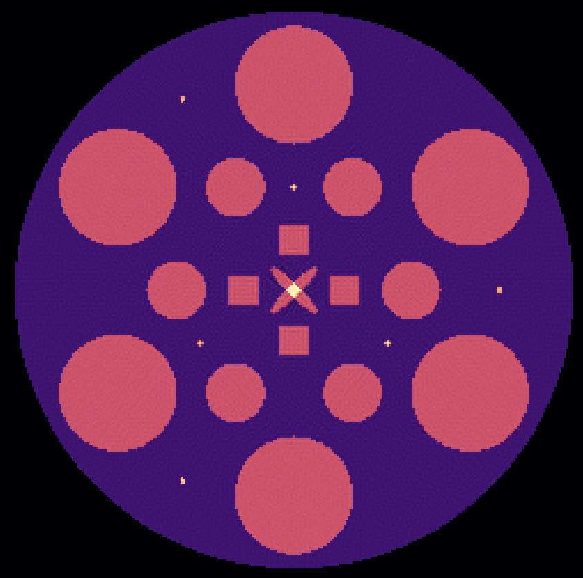
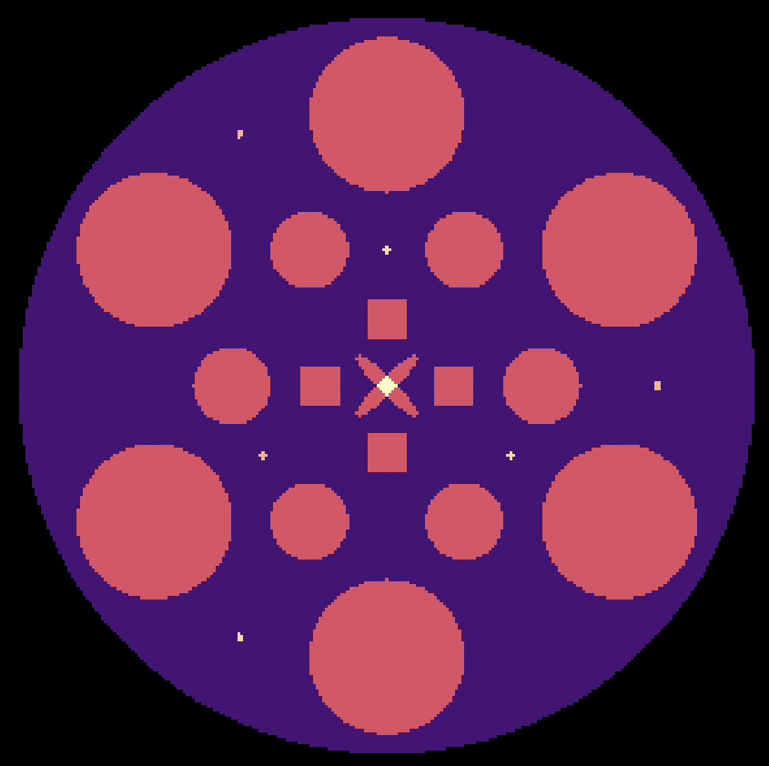
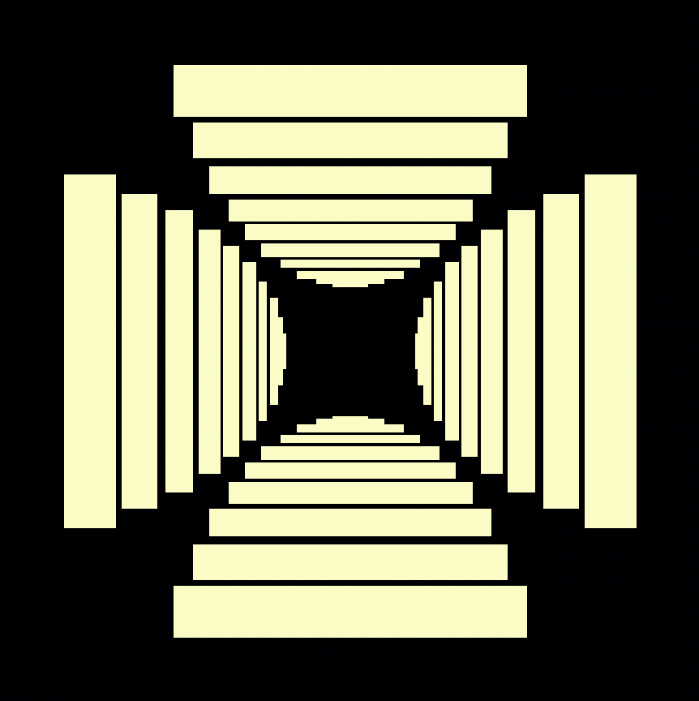

# Image Reconstruction with Cimmino's Algorithm

This project features a Metal/C++ implementation of Cimmino's algorithm for image reconstruction from projection data (sinogram).
The projection (system) matrix is generated using ASTRA-Toolbox, and the sinogram and reconstructed image are computed in Metal shader kernels. The implementation reconstructs a Shepp-Logan phantom from its sinogram. Sequential and OpenMP versions are provided for comparison.


Image reconstruction is a fundamental task in Computed Tomography (CT) and other imaging modalities. Cimmino's algorithm simultaneously reflects the current estimate across all hyperplanes defined by the linear system, generating a sequence of approximations that converge to a solution - either an exact solution if the system is consistent, or a weighted least-squares solution if it is not. The nature of Cimmino's algorithm lends itself well to parallelisation, which is exploited in the Metal/C++ implementation.

## Background

This project was completed as part of the coursework for the unit **SIT315: Concurrent and Distributed Programming** at Deakin University. It is based on the [mathematical report](https://github.com/ksuraev/Cimminos-Algorithm) written concurrently for the unit **SIT292: Linear Algebra for Data Analysis** analysing Cimmino's algorithm.

## Requirements

This projest requires the metal-cpp library (included in the repository in `metal-cpp-library`) and Apple's Metal framework to run the GPU version, as well as GLFW for window management and image display. It is designed to run in VSCode with CMake.

<!-- ## Files

- `CMakeLists.txt`: CMake configuration file for building the project.
- `executionscript.sh`: Script to build and run Cmake reconstruction project for various iteration counts.
- `metal-src/`: Contains the source code for the Metal-Cpp implementation.
- `metal-include/`: Contains header files for the Metal-Cpp implementation.
- `metal-shaders/`: Contains Metal shader files for GPU computations and rendering.
- `Other-Implementations/`: Contains sequential and OpenMP implementations for comparison.
- `metal-data/`: Contains input data files such as the projection matrix and phantom and output files like the sinogram and reconstructed images.
- `metal-logs/`: Contains log files for performance measurements.
- `metal-cpp-library/`: Contains the metal-cpp library files.
- `normalisation-profiler/`: Simple profiler to measure the execution time of 2D sinogram normalisation in isolation.
- `algorithm-tester/`: Tester to verify the correctness of algorithm implementations.
- `Doc/`: Contains documentation and the project report. -->

## Default Geometry Parameters

The default parameters used for generating the projection/system matrix and phantom are as follows:

- Image dimensions: 256x256
- Number of angles: 360
- Total angle degree: 180
- Number of detectors: 725
- Number of iterations: 100 (can be changed via command-line argument)

## Key Results

The Metal/C++ implementation achieves significant speedup for the reconstruction loop compared to the sequential and OpenMP implementations. The relative error norms achieved by all programs are comparable.

For 100 iterations, the performance results are as follows:
| Implementation | Reconstruction Time (ms) | Speedup vs Sequential | Relative Error Norm |
|------------------|-----------------------|----------------------|---------------------|
| Sequential | 20651 | 1 | 0.135 |
| OpenMP | 14417 | 1.4 | 0.135 |
| Metal | 685 | 30.1 | 0.135 |

For 500 iterations, the performance results are as follows:
| Implementation | Reconstruction Time (ms) | Speedup vs Sequential | Relative Error Norm |
|------------------|-----------------------|----------------------|---------------------|
| Sequential | 104291 | 1 | 0.043 |
| OpenMP | 74801 | 1.4 | 0.043 |
| Metal | 3469 | 30.1 | 0.043 |

For 1000 iterations, the performance results are as follows:
| Implementation | Reconstruction Time (ms) | Speedup vs Sequential | Relative Error Norm |
|------------------|-----------------------|----------------------|---------------------|
| Sequential | 208790 | 1 | 0.027 |
| OpenMP | 1502910 | 1.4 | 0.027 |
| Metal | 6952 | 30.0 | 0.027 |

### Best Shepp-Logan Phantom Reconstruction (left) and Original Shepp-Logan Phantom (right)

<div style="display: flex; justify-content: center; align-items: center;">
  
  
</div>

## Other Phantoms:

The implementation can be used to reconstruct other phantoms as well. You can generate the various other phantoms from TomoPhantom using the `other_phantom.py` script in the `metal-data/` directory. Specify the model number and phantom size in the script and update phantom path in `metal-src/main.mm` accordingly.

### Example Reconstructions of Other Phantoms

| TomoPhantom Model | Reconstruction (1000 iterations)                                     | Original Phantom                                                |
| ----------------- | -------------------------------------------------------------------- | --------------------------------------------------------------- |
| Model 4           |   |   |
| Model 11          |  |  |
| Model 13          |  |  |

## Usage

### Metal/C++ Program

1. Ensure you have CMake and a compatible C++ compiler installed.
2. From the root directory, build the project:
   ```bash
    cmake -S . -B build
    cmake --build build
   ```
3. Run the compiled executable:
   ```bash
    ./build/project
   ```
4. Optionally, pass the number of iterations as a command-line argument (default is 100):
   ```bash
    ./build/project [num_iterations]
   ```
5. Run the program for various iteration counts with the execution script:
   ```bash
    ./executionscript.sh
   ```
6. The sinogram, reconstructed image and original phantom will be displayed in a window (use the left and right arrow keys to switch between views). The reconstructed image will also be saved in the `metal-data/` directory.
7. Performance logs will be saved in the `metal-logs/` directory.
8. In order to use a different projection matrix, e.g. for a different image size or number of angles, it must be generated using ASTRA-Toolbox using the Python script `projection_astra.py` in the `metal-data/` directory. You must have ASTRA-Toolbox installed in your Python environment. The matrix should be saved in the `metal-data/` directory and the path to the file should be updated in `metal-src/main.mm`. Then, you must generate the phantom image with the same parameters using the `phantom_astra.py` script in the `metal-data/` directory. The path to the phantom image should be updated in `metal-src/main.mm` as well. Finally, the image dimensions and number of angles are updated in `metal-src/main.mm` to match the newly generated matrix and phantom.
9. The metal shaders are compiled automatically by the CMake build process. If you modify the shaders, re-run the CMake build process to recompile them. The compiled `.metallib` files are saved in the `build` directory. If you wish to compile the shaders manually, you can use the `xcrun -sdk macosx metal` command. For example:
   ```bash
    xcrun -sdk macosx metal -o metallibrary.ir -c kernels.metal
    xcrun -sdk macosx metallib -o metallibrary.metallib metallibrary.ir
   ```

<!-- ### Sequential Version:

From `Other-Implementations` directory, compile and run the sequential version:

```bash
cd Sequential
clang++ -o sequential sequential.cpp ../utilities/Utilities.cpp
./sequential [num_iterations]
```

### OpenMP Version:

From `Other-Implementations/OpenMP` directory, compile and run the OpenMP version:

```bash
 cd OpenMP
 g++-15 -fopenmp -o openmp openmp.cpp ../utilities/Utilities.cpp
 ./openmp [num_iterations]
```

The reconstructed image will be saved in the `data/` directory. To view the reconstructed images, use the `view_images.py` script in the `data/` directory.

### OpenMP/Seq Execution Script:

To run the execution script which compiles and runs the sequential and OpenMP versions for various iteration counts, you must first set the environment variable `PROJECT_BASE_PATH` to the `Other-Implementations` directory path. For example:

```bash
 export PROJECT_BASE_PATH=/path/to/Other-Implementations
```

Then, run the script:

```bash
./execution_script.sh
``` -->

### View Reconstructed Images:

The reconstructed images will be saved in the `metal-data/` directory with the number of iterations appended to the filename. To view the reconstructed images, use the `view_images.py` script in the `metal-data/` directory. Add the path/paths of the .txt images you want to view in the script.
