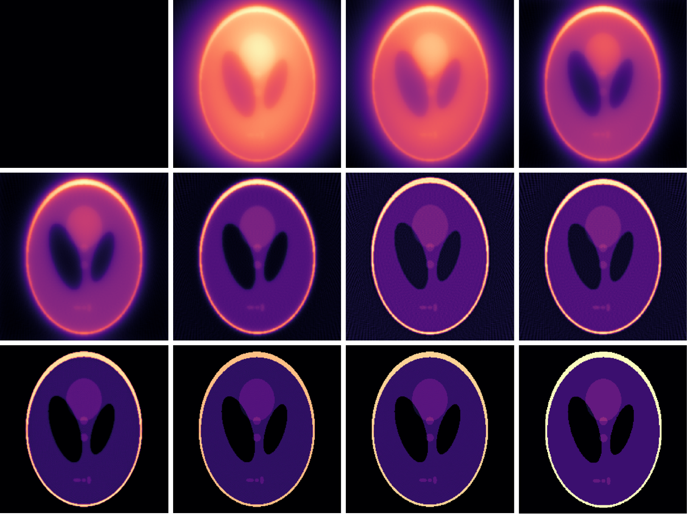

# Image Reconstruction with Cimmino's Algorithm

This repository features a Metal-Cpp implementation of Cimmino's algorithm for image reconstruction. The projection matrix is generated using Astra-Toolbox, and the sinogram and reconstructed image are computed in Metal Shaders. The implementation reconstructs a Shepp-Logan phantom from its sinogram. Sequential and OpenMP versions are provided for comparison.



Image reconstruction is a fundamental task in Computed Tomography (CT) and other imaging modalities. Cimmino's algorithm simultaneously reflects the current estimate across all hyperplanes defined by the linear equations, generating a sequence of approximations that converge to a solution. The nature of Cimmino's algorithm lends itself well to parallelisation.

## Requirements

This projest requires the metal-cpp library (included in the repository in `metal-cpp-library`) and Apple's Metal framework to run the GPU version, as well as GLFW for window management and image display. It is designed to run in VSCode with CMake.
The sequential and OpenMP versions can be compiled with g++ or clang++.

## Files

- `CMakeLists.txt`: CMake configuration file for building the project.
- `metal-src/`: Contains the source code for the Metal-Cpp implementation.
- `metal-include/`: Contains header files for the Metal-Cpp implementation.
- `metal-shaders/`: Contains Metal shader files for GPU computations.
- `Other-Implementations/`: Contains sequential and OpenMP implementations for comparison.
- `metal-data/`: Contains input data files such as the projection matrix and phantom and output files like the sinogram and reconstructed images.
- `metal-logs/`: Contains log files for performance measurements.
- `Doc/`: Contains documentation and the project report.

### Default Geometry Parameters

- Image dimensions: 256x256
- Number of angles: 90
- Total angle degree: 180
- Number of detectors: 725
- Number of iterations: 1000 (can be changed via command-line argument)

## Usage

### Metal-Cpp Version:

1. Ensure you have CMake and a compatible C++ compiler installed.
2. From the root directory, build the project:
   ```bash
    cmake -S . -B build
    cmake --build build --config Release
   ```
3. Run CMake to configure the project:
   ```bash
    ./build/project
   ```
4. Optionally, pass the number of iterations as a command-line argument (default is 1000):
   ```bash
    ./build/project [num_iterations]
   ```
5. The sinogram, reconstructed image and original phantom will be displayed in a window (use the left and right arrow keys to switch between views). The reconstructed image will also be saved in the `metal-data/` directory.
6. Performance logs will be saved in the `metal-logs/` directory.
7. In order to use a different projection matrix, e.g. for a different image size or number of angles, it must be generated using Astra-Toolbox using the Python script `projection_astra.py` in the `data/` directory. You must have Astra-Toolbox installed in your Python environment. The matrix should be saved in the `metal-data/` directory and the path to the file should be updated in `metal-src/main.mm`. Then, you must generate the phantom image with the same parameters using the `phantom_astra.py` script in the `metal-data/` directory. The path to the phantom image should be updated in `metal-src/main.mm` as well. Finally, you must update the image dimensions and number of angles in `metal-src/main.mm` to match the new projection matrix and phantom image. Not setting these parameters correctly will lead to incorrect results or crashes.
8. The metal shaders are compiled automatically by the CMake build process. If you modify the shaders, you must re-run the CMake build process to recompile them. The compiled `.metallib` files are saved in the `build` directory. If you wish to compile the shaders manually, you can use the `xcrun -sdk macosx metal` command. For example:
   ```bash
    xcrun -sdk macosx metal -o metallibrary.ir -c kernels.metal
    xcrun -sdk macosx metallib -o metallibrary.metallib metallibrary.ir
   ```

### Sequential Version:

1. Navigate to the `Other-Implementations` directory:
   ```bash
    cd Other-Implementations
   ```
   2. To run the execution script which compiles and runs the sequential and OpenMP versions for various iteration counts, you must first set the environment variable `PROJECT_BASE_PATH` to the `Other-Implementations` directory path. For example:
   ```bash
    export PROJECT_BASE_PATH=/path/to/Other-Implementations
   ```
   Then, run the script:
   ```bash
   ./execution_script.sh
   ```
2. Alternatively, you can compile and run the sequential version directly:
   ```bash
   cd Sequential
    clang++ -o sequential sequential.cpp ../utilities/Utilities.cpp
    ./sequential [num_iterations]
   ```
3. The reconstructed image will be saved in the `data/` directory. To view the reconstructed images, use the `view_reconstructed_image.py` script in the `data/` directory.

### OpenMP Version:

4. Navigate to the `Other-Implementations` directory:
   ```bash
    cd Other-Implementations
   ```
5. To run the execution script which compiles and runs the sequential and OpenMP versions for various iteration counts, you must first set the environment variable `PROJECT_BASE_PATH` to the `Other-Implementations` directory path. For example:
   ```bash
    export PROJECT_BASE_PATH=/path/to/Other-Implementations
   ```
   Then, run the script:
   ```bash
   ./execution_script.sh
   ```
6. Alternatively, you can compile and run the OpenMP version directly:
   ```bash
    cd OpenMP
    g++-15 -fopenmp -o openmp openmp.cpp ../utilities/Utilities.cpp
    ./openmp [num_iterations]
   ```

### View Reconstructed Images:

The reconstructed images will be saved in the `metal-data/` directory with the number of iterations appended to the filename. To view the reconstructed images, use the `view_reconstructed_image.py` script in the `metal-data/` directory. You must add the path/paths of the images you want to view in the script.
